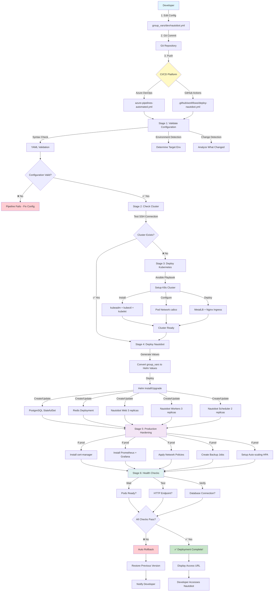
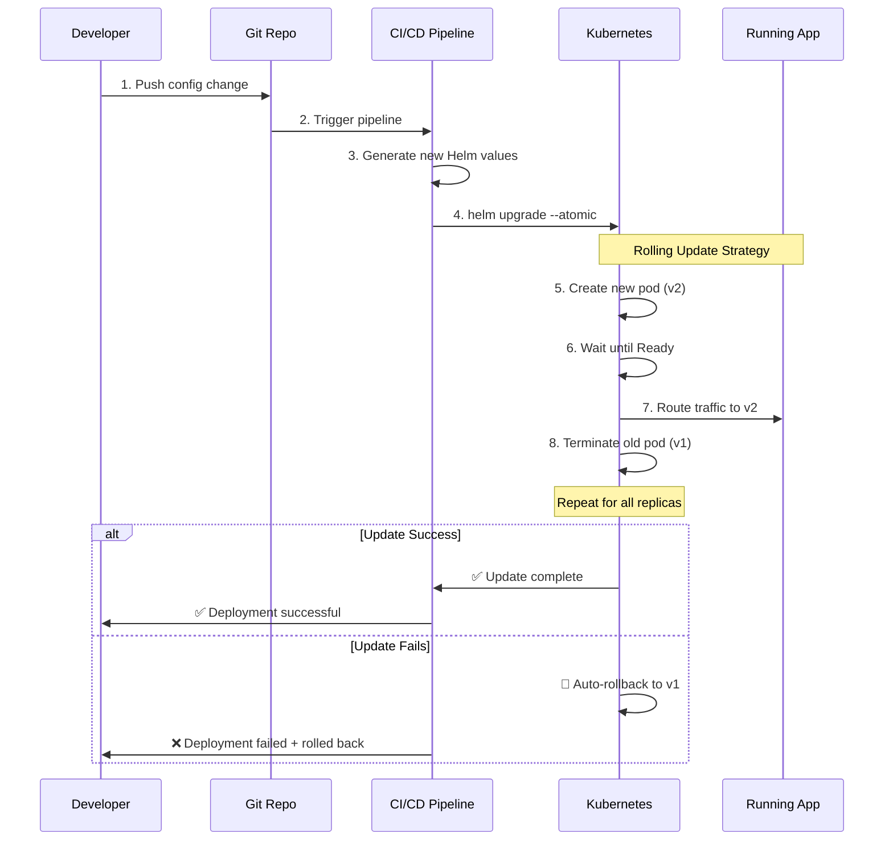

# Automated Deployment Architecture

## 🔄 Deployment Flow Diagram



## 📋 Deployment Stages Breakdown

### Stage 1: Initialize & Validate (2-3 minutes)
```
┌─────────────────────────────────────────────────────────┐
│ 🔍 Validate Configuration                              │
├─────────────────────────────────────────────────────────┤
│ ✓ Install prerequisites (Ansible, Helm, kubectl)       │
│ ✓ Validate YAML syntax                                 │
│ ✓ Check Ansible playbook syntax                        │
│ ✓ Determine target environment (dev/test/prod)         │
│ ✓ Detect what changed (config/helm/playbooks)          │
└─────────────────────────────────────────────────────────┘
```

### Stage 2: Check Cluster Status (1 minute)
```
┌─────────────────────────────────────────────────────────┐
│ ☸️ Kubernetes Cluster Check                            │
├─────────────────────────────────────────────────────────┤
│ ✓ Extract master IP from inventory                     │
│ ✓ Test SSH connectivity                                │
│ ✓ Run: kubectl get nodes                               │
│ ✓ Determine if cluster needs setup                     │
└─────────────────────────────────────────────────────────┘
```

### Stage 3: Deploy Kubernetes (10-15 minutes, if needed)
```
┌─────────────────────────────────────────────────────────┐
│ 🏗️ Kubernetes Cluster Deployment                       │
├─────────────────────────────────────────────────────────┤
│ ✓ Run Ansible playbook: deploy_k8s_all.yml             │
│ ✓ Install Docker on all nodes                          │
│ ✓ Install kubeadm, kubelet, kubectl                    │
│ ✓ Initialize master node                               │
│ ✓ Join worker nodes                                    │
│ ✓ Install Calico pod network                           │
│ ✓ Install MetalLB (LoadBalancer)                       │
│ ✓ Install Nginx Ingress Controller                     │
│ ✓ Configure storage (local-path-provisioner)           │
└─────────────────────────────────────────────────────────┘
```

### Stage 4: Deploy Nautobot (5-10 minutes)
```
┌─────────────────────────────────────────────────────────┐
│ 🚀 Nautobot Application Deployment                     │
├─────────────────────────────────────────────────────────┤
│ 1. Generate Helm Values                                │
│    └─ Read group_vars/ENV/nautobot.yml                 │
│    └─ Convert to Helm values format                    │
│    └─ Apply environment-specific overrides             │
│                                                         │
│ 2. Deploy with Helm                                    │
│    └─ Create namespace: nautobot                       │
│    └─ Deploy PostgreSQL (StatefulSet, 20-50GB)         │
│    └─ Deploy Redis (Deployment, 5-10GB)                │
│    └─ Deploy Nautobot Web (Deployment, 2-3 replicas)   │
│    └─ Deploy Nautobot Workers (Deployment, 2-3)        │
│    └─ Deploy Nautobot Scheduler (Deployment, 1-2)      │
│    └─ Create Services (ClusterIP, LoadBalancer)        │
│    └─ Create Ingress (HTTP/HTTPS routing)              │
│    └─ Create PVCs (media, static, git)                 │
│                                                         │
│ 3. Wait for Pods Ready                                 │
│    └─ Timeout: 15 minutes                              │
│    └─ Atomic: Auto-rollback on failure                 │
└─────────────────────────────────────────────────────────┘
```

### Stage 5: Production Hardening (5-7 minutes, prod only)
```
┌─────────────────────────────────────────────────────────┐
│ 🔒 Production Features (prod only)                     │
├─────────────────────────────────────────────────────────┤
│ 1. Install cert-manager                                │
│    └─ Let's Encrypt ClusterIssuer                      │
│    └─ Automatic TLS certificate generation             │
│                                                         │
│ 2. Install Monitoring Stack                            │
│    └─ Prometheus (metrics collection)                  │
│    └─ Grafana (dashboards)                             │
│    └─ Alertmanager (alerts)                            │
│                                                         │
│ 3. Apply Security Policies                             │
│    └─ Network Policies (pod isolation)                 │
│    └─ Pod Security Standards                           │
│    └─ Resource Limits (CPU/Memory)                     │
│                                                         │
│ 4. Setup Backup Jobs                                   │
│    └─ CronJob: daily PostgreSQL backup                 │
│    └─ Retention: 30 days                               │
│    └─ PVC: 100GB for backups                           │
│                                                         │
│ 5. Configure Auto-scaling                              │
│    └─ HPA: 3-10 replicas for web                       │
│    └─ HPA: 3-15 replicas for workers                   │
│    └─ Triggers: CPU 70%, Memory 80%                    │
│                                                         │
│ 6. Create Pod Disruption Budgets                       │
│    └─ Web: minAvailable = 2                            │
│    └─ Worker: minAvailable = 2                         │
└─────────────────────────────────────────────────────────┘
```

### Stage 6: Validation & Health Checks (2-3 minutes)
```
┌─────────────────────────────────────────────────────────┐
│ ✅ Health Checks & Validation                          │
├─────────────────────────────────────────────────────────┤
│ 1. Pod Health Check                                    │
│    └─ kubectl wait --for=condition=ready               │
│    └─ Timeout: 10 minutes                              │
│    └─ Verify all pods running                          │
│                                                         │
│ 2. Endpoint Health Check                               │
│    └─ Get LoadBalancer IP                              │
│    └─ Test HTTP endpoint                               │
│    └─ Verify HTTP 200/302 response                     │
│                                                         │
│ 3. Database Connectivity                               │
│    └─ Test PostgreSQL connection                       │
│    └─ Verify migrations applied                        │
│                                                         │
│ 4. Display Summary                                     │
│    └─ Access URL: http://LOADBALANCER-IP/              │
│    └─ Username: admin                                  │
│    └─ Password: admin123                               │
│    └─ Environment: dev/test/prod                       │
└─────────────────────────────────────────────────────────┘
```

## 🎯 Total Deployment Time

| Scenario | Duration | Details |
|----------|----------|---------|
| **Initial Deployment** (cluster + app) | 20-30 min | Full infrastructure setup |
| **App Update** (config change) | 5-10 min | Rolling update, zero downtime |
|**Plugin Addition** | 7-12 min | Build image + rolling update |
| **Scale Operation** | 2-3 min | Just replica count change |
| **Production Hardening** | +5-7 min | Only on prod environment |

## 🔄 Update Workflow (Zero Downtime)



## 📊 Component Deployment Order

```
┌─────────────────────────────────────────────────────────┐
│ Deployment Order (dependency chain)                    │
├─────────────────────────────────────────────────────────┤
│                                                         │
│ 1. Namespace (nautobot)                                │
│    └─ kubectl create namespace                         │
│                                                         │
│ 2. Secrets                                             │
│    └─ nautobot-secrets (passwords, keys)               │
│    └─ nautobot-tls (TLS certificate)                   │
│                                                         │
│ 3. ConfigMaps                                          │
│    └─ nautobot-config (Django settings)                │
│                                                         │
│ 4. Storage (PVCs)                                      │
│    ├─ postgresql-data (20-50GB)                        │
│    ├─ redis-data (5-10GB)                              │
│    ├─ nautobot-media (10-20GB)                         │
│    ├─ nautobot-static (2-5GB)                          │
│    └─ nautobot-git (5-10GB)                            │
│                                                         │
│ 5. Database Layer                                      │
│    ├─ PostgreSQL StatefulSet                           │
│    │  └─ Wait for Ready (2-3 min)                      │
│    └─ PostgreSQL Service (ClusterIP)                   │
│                                                         │
│ 6. Cache Layer                                         │
│    ├─ Redis Deployment                                 │
│    │  └─ Wait for Ready (1 min)                        │
│    └─ Redis Service (ClusterIP)                        │
│                                                         │
│ 7. Application Layer                                   │
│    ├─ Nautobot Web Deployment                          │
│    │  ├─ Run migrations (init container)               │
│    │  ├─ Create superuser (init container)             │
│    │  ├─ Collect static files (init container)         │
│    │  └─ Start web pods (2-3 replicas)                 │
│    │     └─ Wait for Ready (3-5 min)                   │
│    │                                                    │
│    ├─ Nautobot Worker Deployment                       │
│    │  └─ Start worker pods (2-3 replicas)              │
│    │     └─ Wait for Ready (1-2 min)                   │
│    │                                                    │
│    └─ Nautobot Scheduler Deployment                    │
│       └─ Start scheduler pods (1-2 replicas)           │
│          └─ Wait for Ready (1 min)                     │
│                                                         │
│ 8. Service Layer                                       │
│    ├─ Nautobot Service (ClusterIP)                     │
│    └─ Nautobot LoadBalancer Service                    │
│       └─ Wait for IP assignment (MetalLB, 30s)         │
│                                                         │
│ 9. Ingress Layer                                       │
│    └─ Nautobot Ingress                                 │
│       ├─ HTTP routing (port 80)                        │
│       ├─ HTTPS routing (port 443)                      │
│       └─ TLS termination                               │
│                                                         │
│ 10. Monitoring (prod only)                             │
│     ├─ ServiceMonitor (Prometheus scraping)            │
│     ├─ Grafana Dashboard                               │
│     └─ AlertRules                                      │
│                                                         │
│ 11. Backup Jobs (prod only)                            │
│     └─ CronJob (daily at 2 AM)                         │
│                                                         │
│ 12. Auto-scaling (prod only)                           │
│     ├─ HPA (web)                                       │
│     └─ HPA (workers)                                   │
│                                                         │
└─────────────────────────────────────────────────────────┘
```

## 🔐 Security Flow

```
┌─────────────────────────────────────────────────────────┐
│ Security Layers (prod deployment)                      │
├─────────────────────────────────────────────────────────┤
│                                                         │
│ Layer 1: Network Security                              │
│    ├─ Firewall rules (NodePorts blocked)               │
│    ├─ Network Policies (pod-to-pod restrictions)       │
│    └─ Single LoadBalancer entry point                  │
│                                                         │
│ Layer 2: TLS/SSL                                       │
│    ├─ cert-manager (Let's Encrypt)                     │
│    ├─ Automatic certificate renewal                    │
│    └─ TLS termination at Ingress                       │
│                                                         │
│ Layer 3: Authentication                                │
│    ├─ Nautobot built-in auth                           │
│    ├─ Django sessions                                  │
│    └─ CSRF protection                                  │
│                                                         │
│ Layer 4: Secrets Management                            │
│    ├─ Kubernetes Secrets (base64)                      │
│    ├─ Ansible Vault (encrypted files)                  │
│    └─ CI/CD platform secrets                           │
│                                                         │
│ Layer 5: Pod Security                                  │
│    ├─ Non-root user (UID 1000)                         │
│    ├─ Read-only root filesystem                        │
│    ├─ Security Context (seccomp, capabilities)         │
│    └─ Resource limits (prevent DoS)                    │
│                                                         │
│ Layer 6: Database Security                             │
│    ├─ Password authentication                          │
│    ├─ Network policy isolation                         │
│    └─ Encrypted connections (SSL)                      │
│                                                         │
└─────────────────────────────────────────────────────────┘
```

## 🎛️ Configuration Propagation

```
group_vars/dev/nautobot.yml
          │
          ├─ nautobot_version: "2.1.0"
          │  └─> Helm: image.tag
          │     └─> Deployment: spec.template.spec.containers[0].image
          │
          ├─ web_replicas: 3
          │  └─> Helm: replicaCount.web
          │     └─> Deployment: spec.replicas
          │
          ├─ nautobot_config.PLUGINS: ["plugin1"]
          │  └─> Helm: nautobot.config.PLUGINS
          │     └─> ConfigMap: NAUTOBOT_PLUGINS
          │        └─> Pod: env.NAUTOBOT_PLUGINS
          │
          ├─ postgres_password: "{{ vault_password }}"
          │  └─> Ansible Vault: decrypted
          │     └─> Helm: postgresql.auth.password
          │        └─> Secret: postgres-password
          │           └─> Pod: env.DB_PASSWORD
          │
          └─ All other settings...
             └─> Automatic conversion and deployment
```

---

## 🎉 Summary

The automated deployment provides:
- ✅ **Zero manual steps** - Just edit and push
- ✅ **Complete visibility** - Every stage logged
- ✅ **Automatic rollback** - Failures don't cause downtime
- ✅ **Production-ready** - Monitoring, backups, HA included
- ✅ **Secure by default** - Multiple security layers
- ✅ **Scalable** - Auto-scaling based on load
- ✅ **Fast** - 5-10 minutes for updates, 20-30 for initial
- ✅ **Repeatable** - Same process every time
- ✅ **Multi-environment** - Dev, test, prod support
- ✅ **GitOps** - All changes tracked in version control
