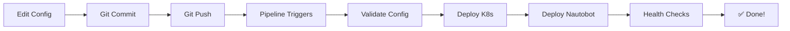

# 🚀 Nautobot Kubernetes - Automated Deployment

## One-Click Deployment for Customers

This repository provides **fully automated deployment** of Nautobot on Kubernetes. Simply edit a configuration file, commit, and push - the entire infrastructure deploys automatically!

---

## ✨ Features

- ✅ **One-Click Deployment** - Edit config file → Push → Automatic deployment
- ✅ **Zero Manual Steps** - No SSH, no kubectl, no manual commands
- ✅ **Production-Ready** - HA, monitoring, backups, auto-scaling included
- ✅ **Multi-Environment** - Dev, Test, Production environments
- ✅ **GitOps Workflow** - All changes tracked in Git
- ✅ **Rollback Support** - Automatic rollback on failure
- ✅ **Health Checks** - Automatic validation after deployment

---

## 🎯 Quick Start (5 Minutes)

### Step 1: Clone Repository
```bash
git clone <your-repo-url>
cd nautobot_ansible_app
```

### Step 2: Run Setup Wizard
```bash
chmod +x scripts/setup_automated_deployment.sh
./scripts/setup_automated_deployment.sh
```

The wizard will:
- Extract your Kubernetes configuration
- Generate CI/CD secrets
- Guide you through CI/CD platform setup
- Create example configuration

### Step 3: Configure CI/CD Secrets

**For Azure DevOps:**
1. Go to Pipelines → Library
2. Create Variable Group: `nautobot-k8s-secrets`
3. Add variables (wizard provides values):
   - `SSH_PRIVATE_KEY`
   - `KUBECONFIG_CONTENT`
   - `GRAFANA_PASSWORD`
   - `LETSENCRYPT_EMAIL`

**For GitHub Actions:**
1. Go to Settings → Secrets and variables → Actions
2. Add repository secrets (wizard provides values):
   - `SSH_PRIVATE_KEY`
   - `KUBECONFIG`
   - `GRAFANA_PASSWORD`
   - `LETSENCRYPT_EMAIL`

### Step 4: Edit Configuration
```bash
vi group_vars/dev/nautobot.yml
```

Example configuration:
```yaml
nautobot_version: "2.1.0"
web_replicas: 2
worker_replicas: 2

nautobot_superuser_username: "admin"
nautobot_superuser_email: "admin@company.com"

nautobot_config:
  PLUGINS:
    - "nautobot_golden_config"
    - "nautobot_device_lifecycle_mgmt"
```

### Step 5: Deploy!
```bash
git add group_vars/dev/nautobot.yml
git commit -m "Initial Nautobot configuration"
git push origin main
```

**That's it!** Watch the pipeline automatically:
1. Validate configuration
2. Setup Kubernetes cluster (if needed)
3. Deploy PostgreSQL & Redis
4. Deploy Nautobot application
5. Run health checks
6. Provide access URL

---

## 📋 What Gets Deployed

### Infrastructure Layer
- ☸️ **Kubernetes Cluster** (5 nodes: 1 master + 4 workers)
- 🌐 **Nginx Ingress Controller** with LoadBalancer
- 📦 **MetalLB** for bare-metal load balancing
- 🔐 **cert-manager** for TLS certificates (prod)

### Application Layer
- 🐘 **PostgreSQL** (replicated, 50GB storage)
- 🔴 **Redis** (replicated, 10GB storage)
- 🚀 **Nautobot Web** (2-3 replicas, auto-scaling)
- ⚙️ **Nautobot Workers** (2-3 replicas)
- ⏰ **Nautobot Scheduler** (1-2 replicas)

### Production Features (when deploying to `prod`)
- 📊 **Prometheus + Grafana** monitoring
- 💾 **Automated Daily Backups** (30-day retention)
- 🔄 **Horizontal Pod Autoscaling** (3-10 replicas)
- 🛡️ **Network Policies** for security isolation
- 🔒 **Let's Encrypt TLS** certificates
- ⚖️ **Pod Disruption Budgets** for HA
- 📈 **Resource Limits** (CPU/Memory)

---

## 🔄 How It Works



---

## 📁 Repository Structure

```
nautobot_ansible_app/
├── group_vars/
│   ├── dev/nautobot.yml      # Dev environment config - EDIT THIS
│   ├── test/nautobot.yml     # Test environment config
│   └── prod/nautobot.yml     # Production environment config
├── inventory/k8s/
│   ├── dev.yml               # Dev cluster inventory
│   ├── test.yml              # Test cluster inventory
│   └── prod.yml              # Prod cluster inventory
├── helm/nautobot/            # Helm chart
├── playbooks/                # Ansible playbooks
├── roles/                    # Ansible roles
├── scripts/
│   └── setup_automated_deployment.sh  # Setup wizard
├── azure-pipelines-automated.yml      # Azure DevOps pipeline
├── .github/workflows/
│   └── deploy-nautobot.yml            # GitHub Actions workflow
└── AUTOMATED_DEPLOYMENT.md           # Quick reference guide
```

---

## 🎛️ Configuration Options

### Basic Configuration
```yaml
# group_vars/dev/nautobot.yml

nautobot_version: "2.1.0"
nautobot_image: "networktocode/nautobot"

web_replicas: 2
worker_replicas: 2
scheduler_replicas: 1
```

### Scaling Configuration
```yaml
# Production auto-scaling (3-10 replicas)
web_replicas: 3
worker_replicas: 3

# Development (fixed replicas)
web_replicas: 2
worker_replicas: 2
```

### Plugin Configuration
```yaml
nautobot_config:
  PLUGINS:
    - "nautobot_golden_config"
    - "nautobot_device_lifecycle_mgmt"
    - "nautobot_ssot"
  
  PLUGINS_CONFIG:
    nautobot_golden_config:
      enable_backup: true
      enable_compliance: true
```

### Database Configuration
```yaml
postgres_db: "nautobot"
postgres_user: "nautobot"
postgres_password: "{{ vault_postgres_password }}"  # Use Ansible Vault

# Storage size (adjust based on needs)
postgresql_storage: "50Gi"  # Production
postgresql_storage: "20Gi"  # Development
```

---

## 🌍 Multi-Environment Deployment

### Environment Mapping
| Git Branch | Environment | Config File | Use Case |
|------------|-------------|-------------|----------|
| `main` | Production | `group_vars/prod/nautobot.yml` | Live system |
| `staging` | Test | `group_vars/test/nautobot.yml` | Pre-production testing |
| `develop` | Development | `group_vars/dev/nautobot.yml` | Development & testing |

### Deploying to Different Environments

**Development:**
```bash
git checkout develop
vi group_vars/dev/nautobot.yml
git commit -am "Update dev config"
git push origin develop
```

**Production:**
```bash
git checkout main
vi group_vars/prod/nautobot.yml
git commit -am "Update prod config"
git push origin main
```

---

## 🔐 Secrets Management

### Using Ansible Vault (Recommended)
```bash
# Create encrypted password file
ansible-vault create group_vars/dev/vault.yml

# Add secrets
postgres_password: "secure-password-here"
redis_password: "secure-password-here"
nautobot_secret_key: "long-random-string-here"

# Reference in nautobot.yml
postgres_password: "{{ vault_postgres_password }}"
```

### Using CI/CD Variables
Store sensitive data in:
- Azure DevOps: Variable Groups
- GitHub: Repository Secrets

---

## 📊 Monitoring & Operations

### Access Grafana (Production)
```bash
kubectl port-forward -n monitoring svc/kube-prometheus-grafana 3000:80
# Open: http://localhost:3000
# Login: admin / <GRAFANA_PASSWORD>
```

### View Logs
```bash
# Application logs
kubectl logs -n nautobot deployment/nautobot-web -f

# Worker logs
kubectl logs -n nautobot deployment/nautobot-worker -f
```

### Check Deployment Status
```bash
kubectl get pods -n nautobot
kubectl get deployments -n nautobot
kubectl get services -n nautobot
```

### Access URLs
```bash
# Get LoadBalancer IP
kubectl get svc ingress-nginx-controller -n ingress-nginx

# Access Nautobot
http://<LOADBALANCER-IP>/
https://<LOADBALANCER-IP>/
```

---

## 🔄 Common Operations

### Adding a New Plugin
1. Edit `group_vars/dev/nautobot.yml`:
   ```yaml
   nautobot_config:
     PLUGINS:
       - "nautobot_golden_config"
       - "nautobot_new_plugin"  # ← Add this
   ```

2. Commit and push:
   ```bash
   git commit -am "Add new plugin"
   git push
   ```

3. Pipeline automatically:
   - Detects plugin change
   - Builds custom image with plugin
   - Updates ConfigMap
   - Performs rolling update (zero downtime!)

### Scaling Application
1. Edit config:
   ```yaml
   web_replicas: 5      # Scale up to 5
   worker_replicas: 4
   ```

2. Push changes - automatic deployment!

### Updating Nautobot Version
1. Edit config:
   ```yaml
   nautobot_version: "2.2.0"  # New version
   ```

2. Push changes - automatic upgrade!

---

## 🆘 Troubleshooting

### Pipeline Fails at "Check Cluster Status"
**Cause:** SSH key or master IP incorrect

**Fix:**
```bash
# Verify SSH access
ssh ubuntu@<MASTER-IP> "kubectl get nodes"

# Re-run setup wizard
./scripts/setup_automated_deployment.sh
```

### Pipeline Fails at "Deploy with Helm"
**Cause:** Invalid Helm values or kubeconfig

**Fix:**
```bash
# Validate Helm chart locally
helm lint helm/nautobot

# Test Helm install
helm install nautobot ./helm/nautobot --dry-run --debug
```

### Application Not Accessible
**Cause:** LoadBalancer IP not assigned or firewall blocking

**Fix:**
```bash
# Check service status
kubectl get svc -n ingress-nginx

# Check MetalLB
kubectl get pods -n metallb-system

# Test from master node
ssh ubuntu@<MASTER-IP>
INGRESS_IP=$(kubectl get svc ingress-nginx-controller -n ingress-nginx -o jsonpath='{.status.loadBalancer.ingress[0].ip}')
curl -I http://$INGRESS_IP/
```

### Pods Stuck in Pending
**Cause:** Insufficient resources or storage issues

**Fix:**
```bash
# Check pod events
kubectl describe pod <pod-name> -n nautobot

# Check node resources
kubectl top nodes

# Check PVC status
kubectl get pvc -n nautobot
```

---

## 🎓 Customer Training

### Day 1: Initial Setup (30 minutes)
1. Run setup wizard
2. Configure CI/CD secrets
3. Push first deployment
4. Verify access

### Day 2: Configuration (1 hour)
1. Understanding group_vars structure
2. Adding plugins
3. Scaling configuration
4. Secrets management

### Day 3: Operations (1 hour)
1. Monitoring with Grafana
2. Viewing logs
3. Troubleshooting common issues
4. Backup/restore procedures

---

## 📚 Additional Documentation

- [AUTOMATED_DEPLOYMENT.md](AUTOMATED_DEPLOYMENT.md) - Quick reference guide
- [PRODUCTION_CHECKLIST.md](PRODUCTION_CHECKLIST.md) - Production readiness checklist
- [K8S_CICD_DEPLOYMENT_GUIDE.md](K8S_CICD_DEPLOYMENT_GUIDE.md) - Detailed technical guide
- [ARCHITECTURE_DIAGRAM.md](ARCHITECTURE_DIAGRAM.md) - System architecture

---

## 🤝 Support

### Getting Help
1. Check [AUTOMATED_DEPLOYMENT.md](AUTOMATED_DEPLOYMENT.md) for quick answers
2. Review pipeline logs in Azure DevOps / GitHub Actions
3. Check application logs: `kubectl logs -n nautobot <pod-name>`
4. Contact support with:
   - Pipeline run URL
   - Environment (dev/test/prod)
   - Error message or logs
   - Configuration file (sanitized)

### Common Questions

**Q: Can I use my own domain name?**  
A: Yes! Update the Ingress configuration in `helm/nautobot/templates/ingress.yaml`

**Q: How do I backup my data?**  
A: Automated daily backups are included in production. Manual backup:
```bash
kubectl exec -n nautobot nautobot-postgresql-0 -- pg_dump -U nautobot nautobot > backup.sql
```

**Q: Can I use external database (RDS/CloudSQL)?**  
A: Yes! Disable built-in PostgreSQL and configure external connection in group_vars.

**Q: How do I restore from backup?**  
A: See [K8S_CICD_DEPLOYMENT_GUIDE.md](K8S_CICD_DEPLOYMENT_GUIDE.md) backup section

---

## 🏆 Success Checklist

- [ ] Setup wizard completed
- [ ] CI/CD secrets configured
- [ ] First deployment successful
- [ ] Application accessible via LoadBalancer IP
- [ ] Login working (admin/admin123)
- [ ] Monitoring dashboard accessible (prod)
- [ ] Team trained on operations
- [ ] Backup strategy verified
- [ ] Production checklist reviewed

---

## 📄 License

[Your License Here]

---

## 🎉 You're Ready!

Your Nautobot deployment is now fully automated. Every configuration change triggers automatic deployment - no manual steps required!

Need help? Check [AUTOMATED_DEPLOYMENT.md](AUTOMATED_DEPLOYMENT.md) or contact support.

**Happy automating! 🚀**
